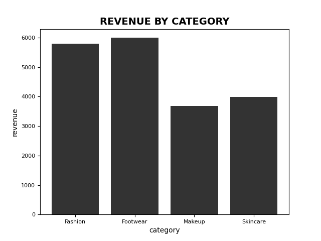
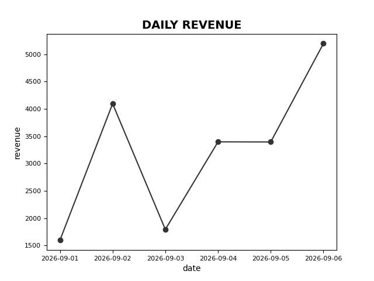
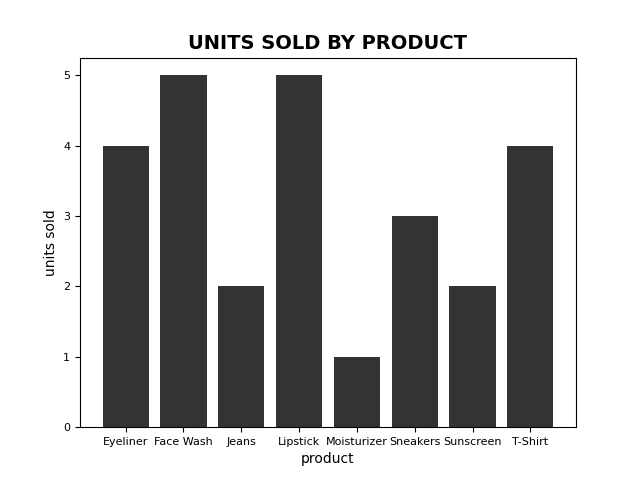

# E-Commerce Sales Analyzer

A python-based data analysis project that analyzes e-commerce saales data using Pandas and Matplotlib.

## Python overview

This project analyzes sales data to identify revenue patterns,product performance, category performance, and daily sales trends.

This project uses Pandas for data analysis and Matplotlib for data visualization

## Features

- Calculte total revenue
- Calculate total units sold
- Calculate average order value
- Identify the best-selling product
- Analyze revenue by product
- Analyze revenue by category
- Analyze units sold by category
- Analyze daily revenue
- Generate visualizations for sales insights

## Technologies used

- Python
- Pandas
- Matplotlib
- Git
- Github

## Project Structure

```text
ecommerce-sales-analyzer/
├── data/
│   └── sales.csv
├── outputs/
│   ├── daily_revenue.png
│   ├── revenue_by_category.png
│   └── units_sold_by_product.png
├── src/
│   └── analyzer.py
├── README.md
└── requirements.txt

## Visualizations

### Revenue by Category


### Daily Revenue


### Units Sold by Product

